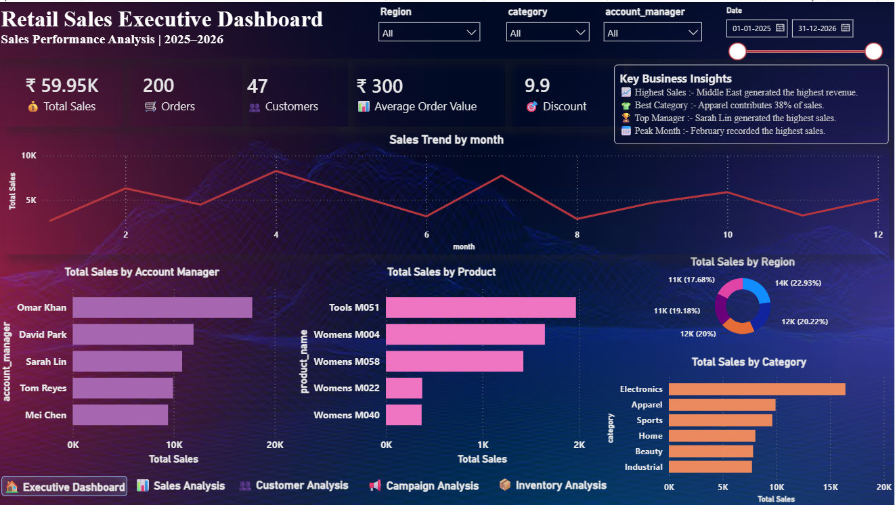
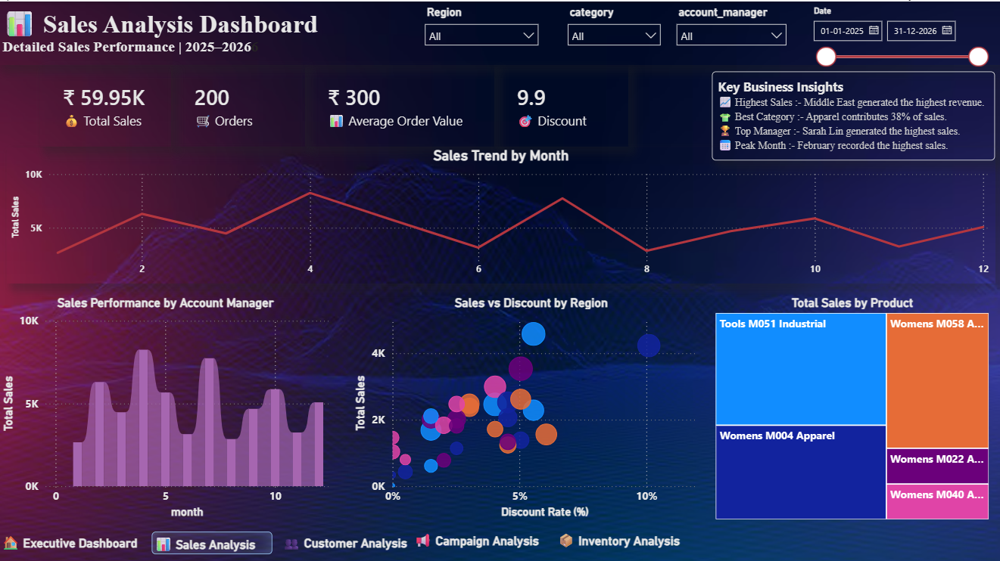
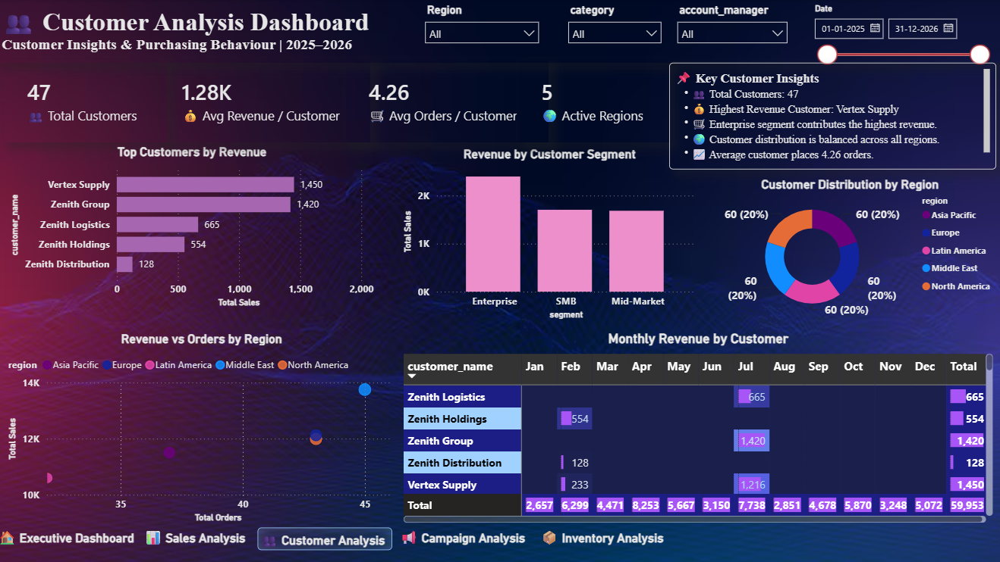
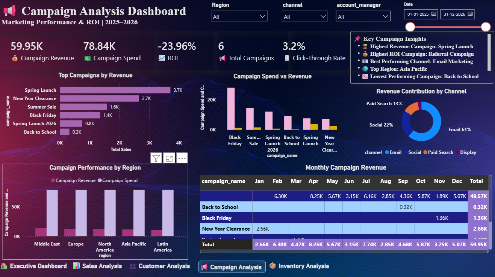
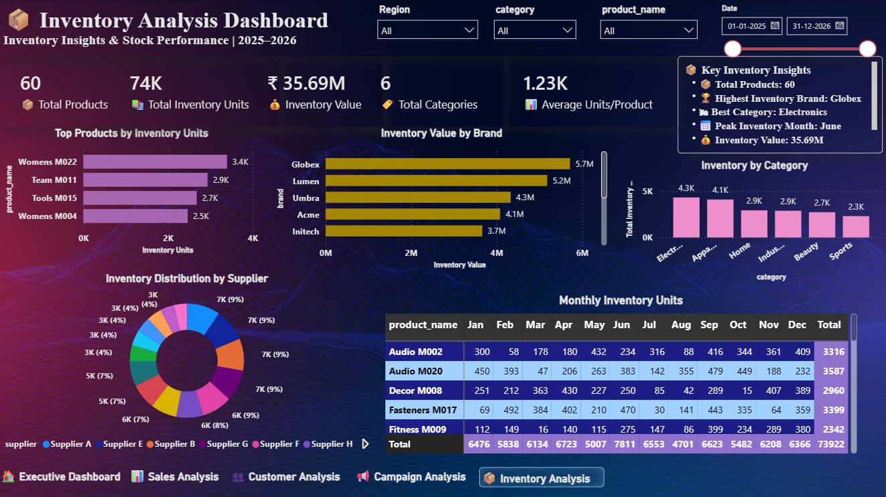
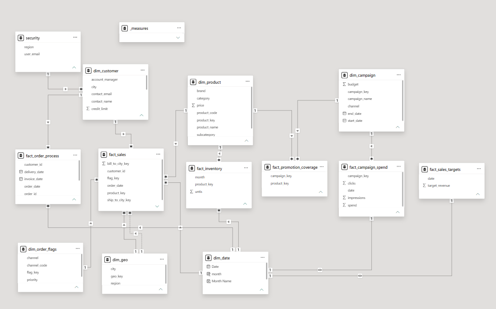

# 📊 Customer Sales Analytics Dashboard

> An end-to-end Business Intelligence project built with **Power BI**, demonstrating data cleaning, data modeling, DAX calculations, and interactive dashboard design for business decision-making.


---

# 📌 Project Overview

This project analyzes customer sales, marketing campaigns, inventory, and overall business performance through an interactive Power BI dashboard.

The project follows a complete Business Intelligence workflow:

- Data Cleaning using Power Query
- Star Schema Data Modeling
- DAX Measure Creation
- Interactive Dashboard Design
- Business Insight Generation

---

# 📊 Dashboards Included

- 📈 Executive Dashboard
- 💰 Sales Dashboard
- 👥 Customer Dashboard
- 📢 Campaign Dashboard
- 📦 Inventory Dashboard

---

# 🖼 Dashboard Preview

## Executive Dashboard



---

## Sales Dashboard



---

## Customer Dashboard



---

## Campaign Dashboard



---

## Inventory Dashboard



---

# 🎯 Business Objectives

- Monitor overall business performance
- Analyze monthly sales trends
- Identify top-performing customers
- Track campaign effectiveness
- Monitor inventory performance
- Evaluate regional sales performance
- Build an interactive reporting solution

---

# 🛠 Tools & Technologies

- Microsoft Power BI
- Power Query
- DAX
- Microsoft Excel / CSV

---

# 📂 Repository Structure

```
Customer-Sales-Analytics
│
├── Dashboard
│   └── Customer_Sales_Analytics.pbix
│
├── DAX_Measures
│   └── Measures.md
│
├── Datasets
│   ├── dim_campaign.csv
│   ├── dim_customer.csv
│   ├── dim_date.csv
│   ├── dim_geo.csv
│   ├── dim_order_flags.csv
│   ├── dim_product.csv
│   ├── fact_campaign_spend.csv
│   ├── fact_inventory.csv
│   ├── fact_order_process.csv
│   ├── fact_promotion_coverage.csv
│   ├── fact_sales.csv
│   ├── fact_sales_targets.csv
│   └── security.csv
│
├── Documentation
│   └── Customer_Sales_Analytics_Report.pdf
│
├── Images
│   ├── Executive_Dashboard.png
│   ├── Sales_Dashboard.png
│   ├── Customer_Dashboard.png
│   ├── Campaign_Dashboard.png
│   ├── Inventory_Dashboard.png
│   └── Data_Model.png
│
├── README.md

```

---

# ⭐ Dashboard Features

### Executive Dashboard

- Business KPIs
- Sales Overview
- Regional Performance
- Customer Summary
- Interactive Filters

---

### Sales Dashboard

- Total Sales
- Total Orders
- Average Order Value
- Regional Sales
- Monthly Sales Trend
- Product Performance

---

### Customer Dashboard

- Total Customers
- Revenue per Customer
- Orders per Customer
- Customer Segmentation
- Regional Customer Distribution

---

### Campaign Dashboard

- Campaign Revenue
- Campaign Spend
- ROI
- Click Through Rate (CTR)
- Revenue by Campaign
- Marketing Channel Performance

---

### Inventory Dashboard

- Total Products
- Inventory Units
- Inventory Value
- Category Analysis
- Brand Performance
- Supplier Distribution

---

# 📈 Key Performance Indicators (KPIs)

- Total Sales
- Total Orders
- Total Customers
- Campaign Revenue
- Campaign Spend
- ROI
- CTR
- Inventory Value
- Average Revenue per Customer
- Average Orders per Customer
- Average Units per Product

---

# 📊 Data Model

The project follows a **Star Schema** consisting of Fact and Dimension tables.

### Dimension Tables

- dim_campaign
- dim_customer
- dim_date
- dim_geo
- dim_order_flags
- dim_product

### Fact Tables

- fact_sales
- fact_campaign_spend
- fact_inventory
- fact_order_process
- fact_promotion_coverage
- fact_sales_targets

---

## Data Model



---

# 🧮 DAX Measures

Custom DAX measures were created for KPI calculations and business analysis.

Examples include:

- Total Sales
- Total Orders
- Total Customers
- Average Revenue per Customer
- Average Orders per Customer
- Campaign Revenue
- Campaign Spend
- ROI
- CTR
- Inventory Value
- Average Units per Product

Complete DAX measures are available in:

```
DAX_Measures/Measures.md
```

---

# 📁 Dataset

The repository contains cleaned CSV files used in the Power BI model.

These include:

- Customer Data
- Product Data
- Sales Data
- Campaign Data
- Inventory Data
- Geographic Data
- Date Dimension
- Security Table

---

# 📄 Documentation

Complete project documentation is available in:

```
Documentation/Customer_Sales_Analytics_Report.pdf
```

---

# 💡 Business Insights

- Identified high-performing products and customers.
- Compared sales across different regions.
- Evaluated marketing campaign performance using ROI and CTR.
- Monitored inventory by brand, category, and supplier.
- Created interactive dashboards to support business decision-making.

---

# 📬 Contact

**Muskan Saini**

📧 Email: **mk6066863@gmail.com**

💼 LinkedIn: *(www.linkedin.com/in/muskan-saini006)*

🐙 GitHub: *(https://github.com/muskan-saini27)*

---

# ⭐ Support

If you found this project useful, consider giving it a ⭐ on GitHub.

It helps others discover the project and supports my portfolio.

---

### © 2026 Muskan Saini | Power BI Analytics Project
